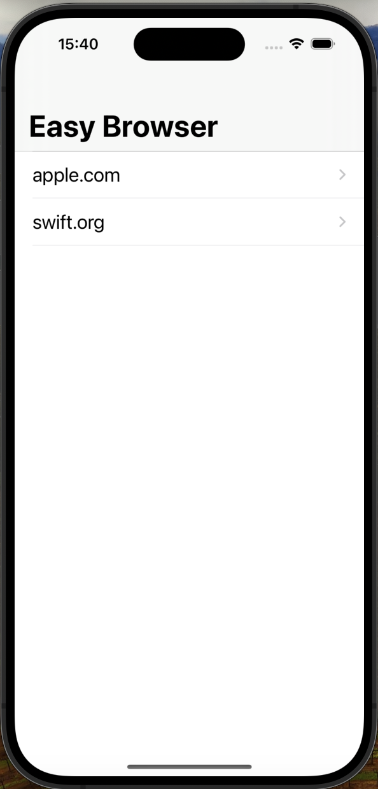

# Project4

Project4 is a simple web browser that allows users to browse and bookmark websites.

## Features

* Displays a list of bookmarked websites
* Allows users to view and navigate to individual websites
* Includes features to reload, go back, and go forward
* Includes a toolbar with progress bar and navigation buttons

## Screenshots

  
   
  <em>Easy Browser Screen</em>

  
   
  <em>Toolbar with Progress Bar and Navigation Buttons</em>

## Requirements

* iOS 12.0+
* Xcode 12.0+
* Swift 5.0+

## Usage

1. Launch the app.
2. View the list of bookmarked websites.
3. Tap on a website to view its details.
4. Use the toolbar to navigate to individual websites.
5. Add new websites to bookmarks.

## Code Overview

### TableViewController

* Manages the list of bookmarked websites and displays them in a table view.
* Handles user interactions, such as selecting a website to view its details.

### ViewController

* Displays the details of a selected website, including its title and content.
* Includes features to reload, go back, and go forward.
* Allows users to add new websites to bookmarks.
* Includes a toolbar with progress bar and navigation buttons.
* Uses WKWebView to load and display web content.
